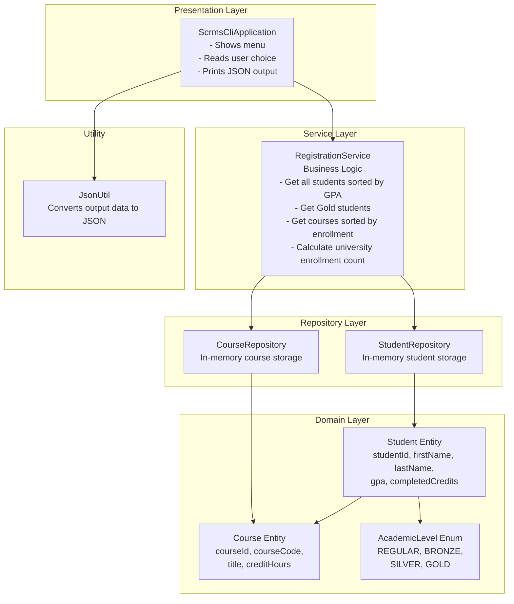

# Solution Architecture Design Diagram

## Layer Responsibilities

| Layer | Responsibility |
| --- | --- |
| Presentation Layer | Handles CLI menu, user input, and displaying output. |
| Service Layer | Contains SCRMS business logic and coordinates repositories. |
| Repository Layer | Stores and retrieves data using in-memory collections. |
| Domain Layer | Defines core entities and academic level rules. |
| Utility | Converts application data into JSON format. |

## OOP Principles Applied

| Principle | How it is applied |
| --- | --- |
| Encapsulation | Entity fields are private and exposed through methods. |
| Abstraction | Repositories hide storage details from the service layer. |
| Single Responsibility | CLI, service, repository, domain, and JSON conversion have separate responsibilities. |
| Object Collaboration | `Student` and `Course` model the many-to-many registration relationship. |
